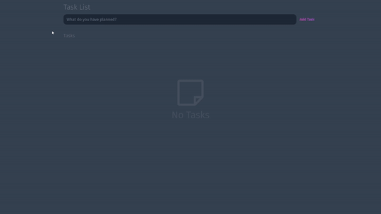

# Task-List

Welcome! This repository contains two folders: server and web.



# 🧠 About

The purpose of this project is to put into practice my knowledges in React, NextJS, JavaScript and API RESTful.

The challenge is to implement a task list with the following functionalities:

- [x] Create a task
- [x] Edit task title
- [x] Edit task status (checked or unchecked)
- [x] Delete task

## 📋 Requirements

- Use Next.js and Javascript
- Use ORM Prisma
- Consume from the server

## 🖥️ Installation

### Frontend

1. Clone this repo
```bash
git clone https://github.com/Marki1ins/frontend-challenge.git
```

2. Go to the project folder
```bash
cd web
```

3. Install dependencies
```bash
npm install
```

3. Run Frontend
```bash
npm run dev
```

### Running the Server


2. Go to the server folder

```bash
cd server
```

3. Install dependencies
```bash
npm install
```

3. Run start
```bash
npm run dev
```


